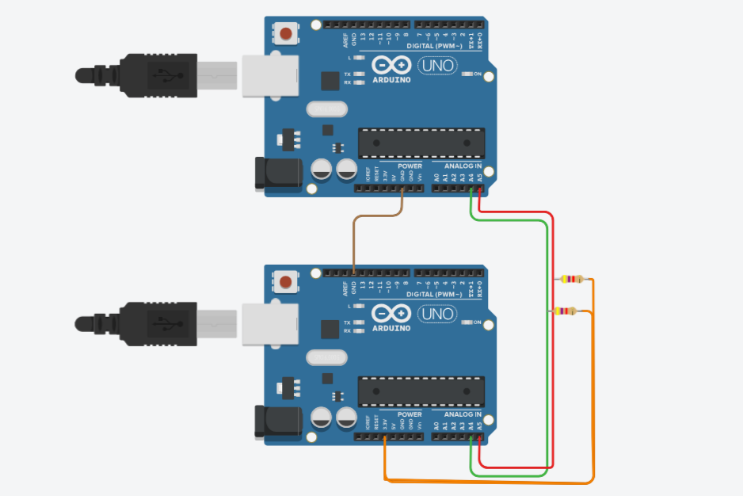
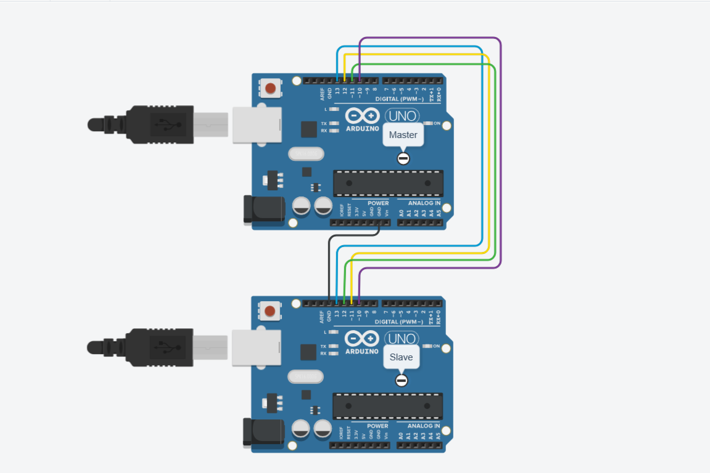
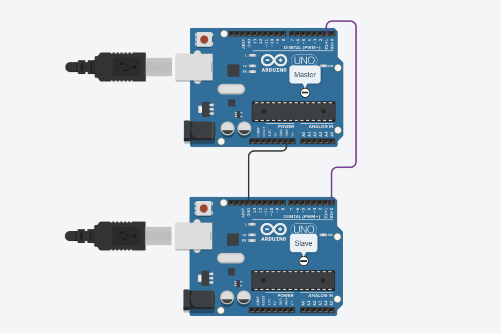
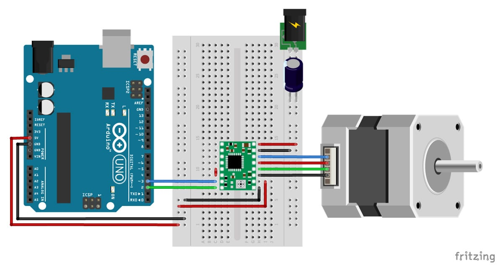
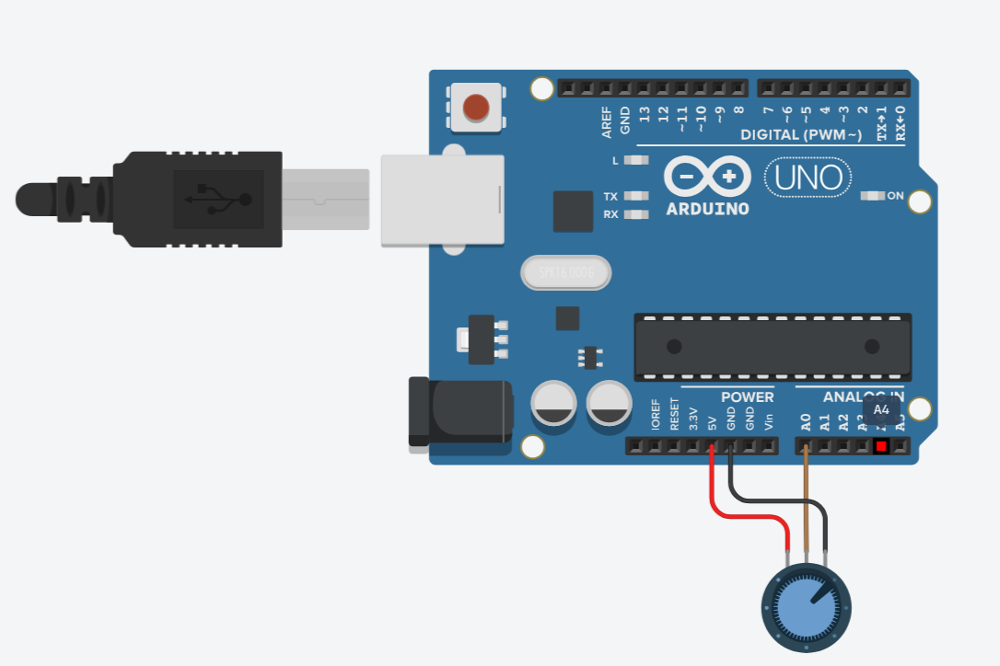
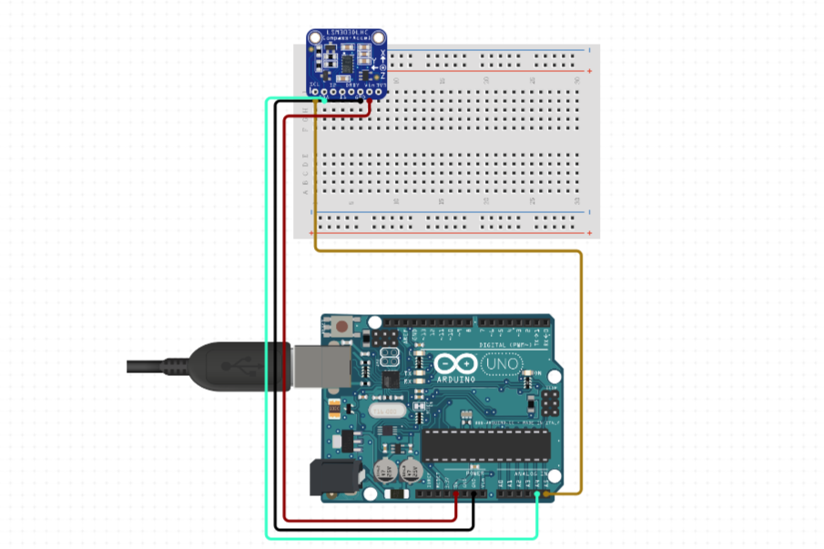

# Arduino Communication & Control Projects

A collection of standalone Arduino-based mini-projects demonstrating core embedded communication protocols (I2C, SPI, UART) and peripheral integrations (Stepper Motor, Rotary Encoder, IMU). Each project includes schematics, pin configurations, and tested Arduino code to help you learn and prototype quickly.

## Installation

1. Download and install the latest Arduino IDE from the official website:  
   [https://www.arduino.cc/en/software](https://www.arduino.cc/en/software)

2. Install required libraries (if any) via Arduino Library Manager or GitHub:  
   - **SparkFun MPU9250 DMP**:  
     [https://github.com/sparkfun/SparkFun_MPU9250_DMP_Arduino_Library](https://github.com/sparkfun/SparkFun_MPU9250_DMP_Arduino_Library)

---

## Products & Official Links

| Product          | Description                     | Official Link                                                 |
|------------------|---------------------------------|---------------------------------------------------------------|
| Arduino UNO/Mega  | Microcontroller Board            | [Arduino UNO](https://www.arduino.cc/en/Main/ArduinoBoardUno) |
| MPU-9250         | 9-DoF IMU Sensor                 | [MPU-9250](https://de.aliexpress.com/item/1005008084975253.html?aff_fcid=e7ae9ccec3044539968afa0e367d9637-1751313038112-07038-_opJB5t8&tt=CPS_NORMAL&aff_fsk=_opJB5t8&aff_platform=shareComponent-detail&sk=_opJB5t8&aff_trace_key=e7ae9ccec3044539968afa0e367d9637-1751313038112-07038-_opJB5t8&terminal_id=34e32124aa7c49db9ea7a9c91389e061&afSmartRedirect=y&gatewayAdapt=glo2deu) |
| Stepper Motor    |  Stepper Motor Driver           | [A4988 Stepper Drive](https://de.aliexpress.com/item/1005001621676770.html?af=2049356_1&cv=41155805&cn=46syopw9s87gsixiwdjt2q1n90nf2w55&dp=v5_46syopw9s87gsixiwdjt2q1n90nf2w55&af=2049356_1&cv=41155805&cn=46syopw9s87gsixiwdjt2q1n90nf2w55&dp=v5_46syopw9s87gsixiwdjt2q1n90nf2w55&utm_source=epn&utm_medium=cpa&utm_campaign=2049356_1&utm_content=41155805&product_id=1005001621676770&afref=&aff_fcid=fdf976ce2ee748c78c8b28746ca1b64e-1751313177294-03219-_9G57Xi&aff_fsk=_9G57Xi&aff_platform=portals-hotproduct&sk=_9G57Xi&aff_trace_key=fdf976ce2ee748c78c8b28746ca1b64e-1751313177294-03219-_9G57Xi&terminal_id=34e32124aa7c49db9ea7a9c91389e061&afSmartRedirect=y) |
| Rotary Encoder   | Incremental Rotary Encoder       | [Rotary Encoder](https://pankaj.com/wp-content/uploads/2016/03/NCP711-S_V.pdf) |

---

# Projects Overview

Each project contains:

- **Pinout diagram**  
- **Pin configuration**  
- **Code folder link**

---

## 1. I2C Master Receive / Slave Transmit

This project demonstrates I2C communication where the Master requests data from the Slave, and the Slave transmits data back.

| Pin   | Function       | Connection                         |
|-------|----------------|----------------------------------|
| A4    | SDA (Data)     | Connect SDA pins of Master & Slave |
| A5    | SCL (Clock)    | Connect SCL pins of Master & Slave |
| GND   | Ground         | Common Ground                     |
| 5V    | Power          | Match board voltage               |

### 📂 Code  
- [I2C_Master/I2C_Master.ino](./01.%20I2C_Master_receive_Slave_transmit/I2C_Master/I2C_Master.ino)  
- [I2C_Slave/I2C_Slave.ino](./01.%20I2C_Master_receive_Slave_transmit/I2C_Slave/I2C_Slave.ino)  

### Expected Behavior
- The Master Arduino sends a request to the Slave for data.
- The Slave Arduino responds by transmitting the requested data.
- The Master receives and prints the data on its Serial Monitor.
- Communication runs smoothly at 100 kHz (standard I2C speed).

---

## 2. I2C Master Transmit / Slave Receive

This project demonstrates I2C communication where the Master transmits data to the Slave, and the Slave receives it.

| Pin   | Function       | Connection                         |
|-------|----------------|----------------------------------|
| A4    | SDA (Data)     | Connect SDA pins of Master & Slave |
| A5    | SCL (Clock)    | Connect SCL pins of Master & Slave |
| GND   | Ground         | Common Ground                     |
| 5V    | Power          | Match board voltage               |

### 📂 Code  
- [I2C_Master/I2C_Master.ino](./02.%20I2C_Master_transmit_Slave_receive/I2C_Master/I2C_Master.ino)  
- [I2C_Slave/I2C_Slave.ino](./02.%20I2C_Master_transmit_Slave_receive/I2C_Slave/I2C_Slave.ino) 

### Expected Behavior
- The Master Arduino continuously sends data to the Slave.
- The Slave Arduino receives the transmitted data and prints it on its Serial Monitor.
- Data transmission occurs reliably without loss or errors.
- Communication speed is set to standard I2C frequency.
 

---

## 3. SPI Communication – Master and Slave

This project demonstrates **SPI communication** between two Arduino boards:  
- One configured as the **Master** to transmit data.  
- One configured as the **Slave** to receive and display the data.

### 🔌 Pin Configuration (Common SPI Pins)

| Pin  | Function              | Master Arduino           | Slave Arduino            |
|------|-----------------------|--------------------------|--------------------------|
| 11   | MOSI (Master Out, Slave In) | → Connects to Slave's MOSI | ← Receives from Master's MOSI |
| 12   | MISO (Master In, Slave Out) | ← Connects to Slave's MISO | → Sends to Master's MISO |
| 13   | SCK  (Clock)          | → Drives Clock           | ← Receives Clock         |
| 10   | SS (Slave Select)     | → Pull LOW to select     | Input - Chip Select      |
| GND  | Ground                | ↔ Common Ground          | ↔ Common Ground          |
| 5V   | Power (if needed)     | Shared if same board voltage | Shared if same board voltage |

> ⚠️ Connect **MOSI to MOSI**, **MISO to MISO**, **SCK to SCK**, and ensure **common GND** between devices.

### 📂 Code

- **Master**: [`SPI_MASTER/SPI_MASTER.ino`](./03.%20SPI_MASTER/SPI_MASTER.ino)  
- **Slave**: [`SPI_SLAVE/SPI_SLAVE.ino`](./04.%20SPI_SLAVE/SPI_SLAVE.ino)

### 🧪 Expected Behavior

- The **Master** sends incrementing integer data over SPI every 2 seconds.  
- The **Slave** receives and prints the transmitted value via Serial Monitor.

---

## 4. UART Communication – Transmit and Receive Integer

This project demonstrates UART communication between two Arduino boards, where one **transmits integer data** and the other **receives and prints it**.

### 🔌 Pin Configuration

| Pin  | Function | Transmitter Connection      | Receiver Connection           |
|------|----------|-----------------------------|-------------------------------|
| D1   | TX       | → RX of Receiver (D0)       |                               |
| D0   | RX       |                             | ← TX of Transmitter (D1)      |
| GND  | Ground   | ↔ Common Ground             | ↔ Common Ground               |

> ⚠️ Make sure both Arduino boards share a common ground for UART to work correctly.

### 📂 Code

- **Transmitter**: [`UART_transmit_integer/transmit_integer.ino`](./05.%20UART_transmit_integer/transmit_integer.ino)  
- **Receiver**: [`UART_receive_integer/receive_integer.ino`](./06.%20UART_receive_integer/receive_integer.ino)

### 🧪 Expected Behavior

- The **transmitter** continuously sends an increasing integer value every second.
- The **receiver** reads the integer via UART and prints it to the serial monitor. 

---

## 5. Stepper Motor Control

This project controls a **NEMA17 stepper motor** using a simple step and direction interface.

The motor rotates to a specified angle in the **clockwise** direction and then reverses to the same angle in the **counter-clockwise** direction using digital pulses.

> 🛠 The code assumes a **stepper driver (e.g., A4988 or DRV8825)** connected to the Arduino.  
> Adjust steps per revolution in code if using a different motor or driver microstepping mode.

### 🔌 Pin Configuration

| Pin | Function   | Description                 |
|------|------------|-----------------------------|
| 3    | STEP       | Pulse to step motor         |
| 4    | DIR        | Direction of rotation       |
| GND  | Ground     | Common ground               |
| 5V   | Power      | Motor driver logic supply   |

### 📂 Code  
- [Stepper_motor/Stepper_motor.ino](./07.%20Stepper_motor/Stepper_motor.ino)  

### 🧪 Expected Behavior

- On power-up, the motor:
  - Rotates **90 degrees clockwise**
  - Waits for **2 seconds**
  - Rotates **90 degrees counter-clockwise**
  - Waits for **2 seconds**
- This cycle repeats continuously.

---

## 6. Rotary Encoder Integration

This project reads the analog signal from a **Pankaj Rotary Encoder** (analog-type) to estimate the direction and amount of rotation.

> ⚠️ This is not a typical quadrature encoder. It outputs analog voltages which are used to determine relative movement.

### 🔌 Pin Configuration

| Pin  | Function      | Description                         |
|------|---------------|-------------------------------------|
| A0   | Analog output | Reads voltage change from encoder   |
| GND  | Ground        | Common ground                       |
| 5V   | Power         | Sensor power supply                 |

### 📂 Code  
- [Rotary_encoder/rotary_encoder.ino](./08.%20Rotary_encoder/rotary_encoder.ino)  

### 🧪 Expected Behavior

- The code continuously monitors changes in analog voltage on **A0**.
- It compares current and previous values to:
  - Increment a counter when turned **clockwise**
  - Decrement the counter when turned **counter-clockwise**
- Output is printed to Serial Monitor as position updates (`disp1`).
---

## 7. IMU MPU9250 Integration

This project demonstrates integration of the **SparkFun MPU9250 IMU** sensor using the DMP (Digital Motion Processor) feature for real-time orientation tracking.

### 🔌 Pin Configuration

| Pin  | Function     | Description                     |
|-------|--------------|---------------------------------|
| A4    | SDA          | I2C Data Line                   |
| A5    | SCL          | I2C Clock Line                  |
| 3.3V  | Power        | Sensor power supply (3.3V)      |
| GND   | Ground       | Common ground                   |

### 📂 Code  
- [IMU_SparkFunMPU9250/IMU.ino](./09.%20IMU_SparkFunMPU9250/IMU.ino)  

### 🧪 Expected Behavior

- The MPU9250 sensor initializes and starts its onboard DMP.
- The sensor calculates quaternion data representing 3D orientation.
- The Arduino reads and processes quaternion to compute yaw, pitch, and roll.
- Yaw values are sent over Serial1.
- The Serial Monitor displays debug info, and orientation data can be used for motion tracking applications.

---

## Notes

- Always ensure common ground between boards.  
- Match power voltage levels across devices.  
- Refer to respective folder for full code and comments.

---

*Happy Coding!*
