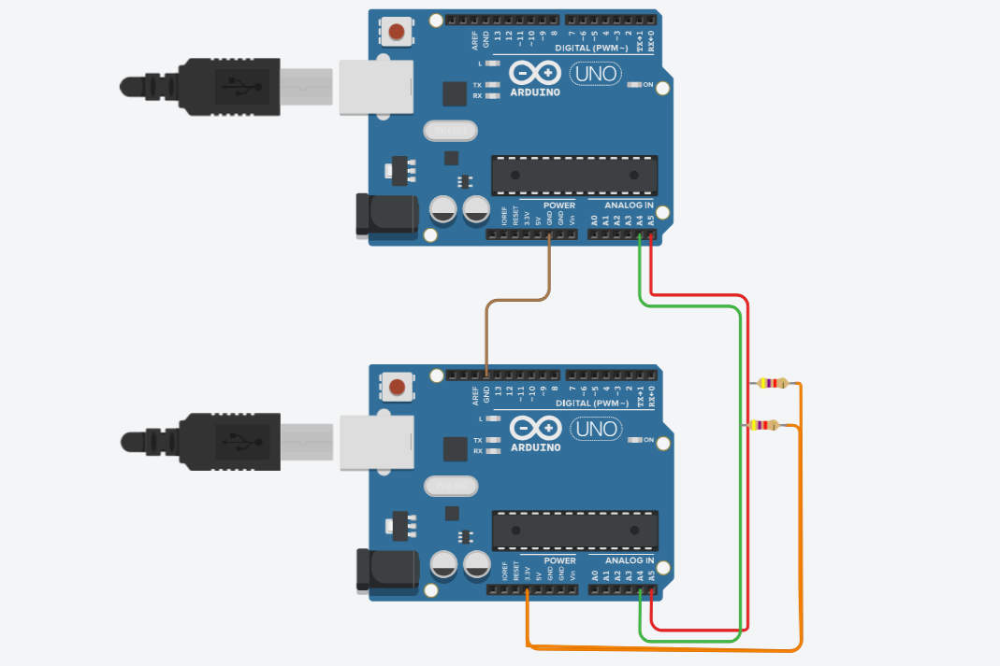

# Arduino Communication & Control Projects

A collection of standalone Arduino-based mini-projects demonstrating core embedded communication protocols (I2C, SPI, UART) and peripheral integrations (Stepper Motor, Rotary Encoder, IMU). Each project includes schematics, pin configurations, and tested Arduino code to help you learn and prototype quickly.

## Installation

1. Download and install the latest Arduino IDE from the official website:  
   [https://www.arduino.cc/en/software](https://www.arduino.cc/en/software)

2. Install required libraries (if any) via Arduino Library Manager or GitHub:  
   - **SparkFun MPU9250 DMP**:  
     [https://github.com/sparkfun/SparkFun_MPU9250_DMP_Arduino_Library](https://github.com/sparkfun/SparkFun_MPU9250_DMP_Arduino_Library)

---

## Products & Official Links

| Product          | Description                     | Official Link                                                 |
|------------------|---------------------------------|---------------------------------------------------------------|
| Arduino UNO/Mega  | Microcontroller Board            | [Arduino UNO](https://www.arduino.cc/en/Main/ArduinoBoardUno) |
| MPU-9250         | 9-DoF IMU Sensor                 | [MPU-9250](https://de.aliexpress.com/item/1005008084975253.html?aff_fcid=e7ae9ccec3044539968afa0e367d9637-1751313038112-07038-_opJB5t8&tt=CPS_NORMAL&aff_fsk=_opJB5t8&aff_platform=shareComponent-detail&sk=_opJB5t8&aff_trace_key=e7ae9ccec3044539968afa0e367d9637-1751313038112-07038-_opJB5t8&terminal_id=34e32124aa7c49db9ea7a9c91389e061&afSmartRedirect=y&gatewayAdapt=glo2deu) |
| Stepper Motor    |  Stepper Motor Driver           | [A4988 Stepper Drive](https://de.aliexpress.com/item/1005001621676770.html?af=2049356_1&cv=41155805&cn=46syopw9s87gsixiwdjt2q1n90nf2w55&dp=v5_46syopw9s87gsixiwdjt2q1n90nf2w55&af=2049356_1&cv=41155805&cn=46syopw9s87gsixiwdjt2q1n90nf2w55&dp=v5_46syopw9s87gsixiwdjt2q1n90nf2w55&utm_source=epn&utm_medium=cpa&utm_campaign=2049356_1&utm_content=41155805&product_id=1005001621676770&afref=&aff_fcid=fdf976ce2ee748c78c8b28746ca1b64e-1751313177294-03219-_9G57Xi&aff_fsk=_9G57Xi&aff_platform=portals-hotproduct&sk=_9G57Xi&aff_trace_key=fdf976ce2ee748c78c8b28746ca1b64e-1751313177294-03219-_9G57Xi&terminal_id=34e32124aa7c49db9ea7a9c91389e061&afSmartRedirect=y) |
| Rotary Encoder   | Incremental Rotary Encoder       | [Rotary Encoder](https://pankaj.com/wp-content/uploads/2016/03/NCP711-S_V.pdf) |

---

# Projects Overview

Each project contains:

- **Pinout diagram**  
- **Pin configuration**  
- **Code folder link**

---

## 1. I2C Master Receive / Slave Transmit

| Pin   | Function       | Connection                  |
|-------|----------------|-----------------------------|
| A4    | SDA (Data)     | Connect between Master & Slave |
| A5    | SCL (Clock)    | Connect between Master & Slave |
| GND   | Ground         | Common Ground                |
| 5V    | Power          | Match board voltage          |

**Code:**  
- [I2C_Master/I2C_Master.ino](./I2C_Master/I2C_Master.ino)  
- [I2C_Slave/I2C_Slave.ino](./I2C_Slave/I2C_Slave.ino)  

---

## 2. I2C Master Transmit / Slave Receive

| Pin   | Function       | Connection                  |
|-------|----------------|-----------------------------|
| A4    | SDA (Data)     | Connect between Master & Slave |
| A5    | SCL (Clock)    | Connect between Master & Slave |
| GND   | Ground         | Common Ground                |
| 5V    | Power          | Match board voltage          |

**Code:**  
- [I2C_Master/I2C_Master.ino](./I2C_Master/I2C_Master.ino)  
- [I2C_Slave/I2C_Slave.ino](./I2C_Slave/I2C_Slave.ino)  

---

## 3. SPI Master Communication

| Pin  | Function        | Connection              |
|-------|----------------|-------------------------|
| 11    | MOSI           | Master Out, Slave In    |
| 12    | MISO           | Master In, Slave Out    |
| 13    | SCK            | Clock                   |
| 10    | SS (Slave Select) | Selects Slave          |
| GND   | Ground         | Common Ground           |
| 5V    | Power          | Match board voltage     |

**Code:**  
- [SPI_MASTER/SPI_MASTER.ino](./SPI_MASTER/SPI_MASTER.ino)  

---

## 4. SPI Slave Communication

| Pin  | Function        | Connection              |
|-------|----------------|-------------------------|
| 11    | MOSI           | Master Out, Slave In    |
| 12    | MISO           | Master In, Slave Out    |
| 13    | SCK            | Clock                   |
| 10    | SS (Slave Select) | Selects Slave          |
| GND   | Ground         | Common Ground           |
| 5V    | Power          | Match board voltage     |

**Code:**  
- [SPI_SLAVE/SPI_SLAVE.ino](./SPI_SLAVE/SPI_SLAVE.ino)  

---

## 5. UART Communication – Transmit and Receive Integer

This project demonstrates UART communication between two Arduino boards, where one **transmits integer data** and the other **receives and prints it**.

### 🔌 Pin Configuration

| Pin  | Function | Transmitter Connection      | Receiver Connection           |
|------|----------|-----------------------------|-------------------------------|
| D1   | TX       | → RX of Receiver (D0)       |                               |
| D0   | RX       |                             | ← TX of Transmitter (D1)      |
| GND  | Ground   | ↔ Common Ground             | ↔ Common Ground               |

> ⚠️ Make sure both Arduino boards share a common ground for UART to work correctly.

### 📂 Code

- **Transmitter**: [`UART_transmit_integer/transmit_integer.ino`](./UART_transmit_integer/transmit_integer.ino)  
- **Receiver**: [`UART_receive_integer/receive_integer.ino`](./UART_receive_integer/receive_integer.ino)

### 🧪 Expected Behavior

- The **transmitter** continuously sends an increasing integer value every second.
- The **receiver** reads the integer via UART and prints it to the serial monitor. 

---

## 7. Stepper Motor Control

| Pin | Function   |
|------|------------|
| 3    | STEP       |
| 4    | DIR        |
| GND  | Ground     |
| 5V   | Power      |

**Code:**  
- [Stepper_motor/Stepper_motor.ino](./Stepper_motor/Stepper_motor.ino)  

---

## 8. Rotary Encoder Integration

| Pin  | Function           |
|-------|--------------------|
| A0    | Analog output      |
| GND   | Ground             |
| 5V    | Power              |

**Code:**  
- [Rotary_encoder/rotary_encoder.ino](./Rotary_encoder/rotary_encoder.ino)  

---

## 9. IMU MPU9250 Integration

| Pin  | Function     |
|-------|--------------|
| A4    | SDA          |
| A5    | SCL          |
| 3.3V  | Power        |
| GND   | Ground       |

**Code:**  
- [IMU_SparkFunMPU9250/IMU.ino](./IMU_SparkFunMPU9250/IMU.ino)  

---

## Notes

- Always ensure common ground between boards.  
- Match power voltage levels across devices.  
- Refer to respective folder for full code and comments.

---

*Happy Coding!*
